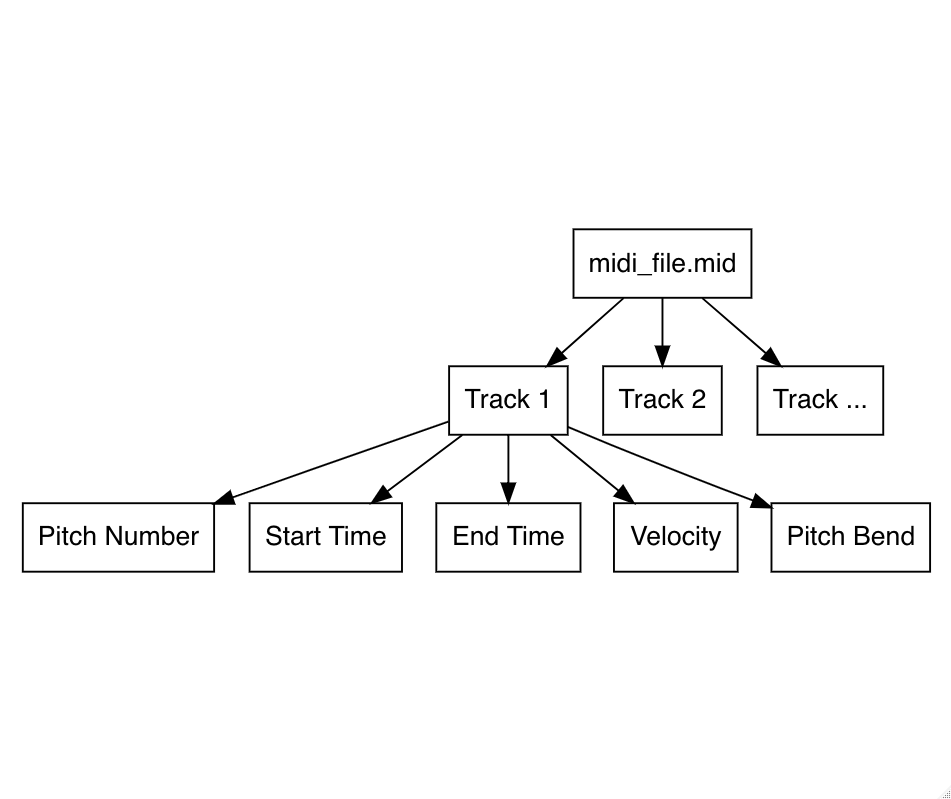
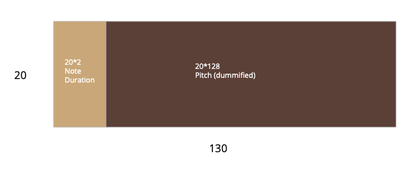
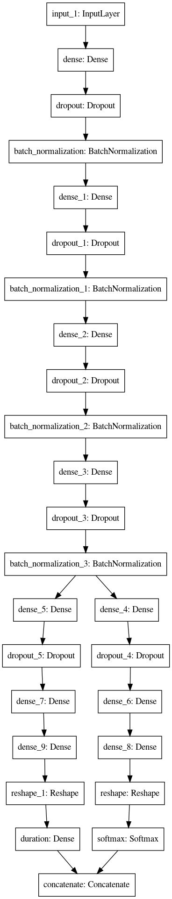
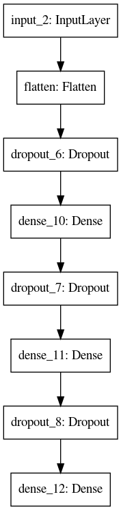
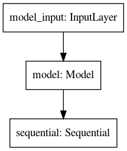

# Methodology {#methodology .unnumbered}

## Data {#methodology-data .unnumbered}

The training data used to train our model is a collection of midi files that was compiled by a Reddit user [see reddit page](https://www.reddit.com/r/WeAreTheMusicMakers/comments/3ajwe4/the_largest_midi_collection_on_the_internet/) and put up for [download](https://mega.co.nz/#!Elg1TA7T!MXEZPzq9s9YObiUcMCoNQJmCbawZqzAkHzY4Ym6Gs_Q). There are about 130,000 midi files from a wide range of genres included in this collection. Our training, however, centers around a small subset of the files that are of 4/4 rhythm, in order to reduce the chance of complication from training with a wider range of rhythmic patterns.

In addition, in our pre-processing script, we took steps to "normalize" the samples as much as we can, in terms of making the tempo constant as well as transposing all songs to the key of C major (or A minor if in minor key). The efforts to normalize keys is not always successful. In some midi files, tempo and key changes are included as part of the metadata, which we can then extract and make changes accordingly. But in others, the metadata is not included.

Before diving deeper into the details of our data, it is necessary to introduce the basic structure of midi files. Midi files (.mid) are digital records of musical "events" divided into various tracks, where each track contains a voice, an instrument, or a line of melody. For example, a midi file containing piano music might have two tracks representing the notes played by the two hands of the human piano player. Each time the human player plays a note, the midi file would record the following information: at what time is the piano key pressed; at what time is the key released; how hard is the key pressed; what is the pitch bend. After collecting these information for each and every note in a song in a midi file, we will have most of the information needed to reproduce the song in its entirety down to some basic expressive elements. In the midi metadata, some other relevant information is stored, such as tempo, key, tempo changes, etc. Midi files are not music by themselves because they only contain the information needed to produce music: it is the digital equivalent of the sheet music. Midi decoders and synthesizers are needed to translate midi files into music.

If we strip the midi file structure down to its most basic elements, it would look something like this:

```{r, out.width="0.8\\linewidth", include=TRUE, fig.align="center", fig.cap=c("Midi File Structure"), echo=FALSE}

```

We can imagine the midi file to be a dictionary, where each track is indexed by its name, and in each track we have a nice tabular structure of data consisting of the following columns: pitch number, start time, end time, and pitch velocity (we will ignore pitch bend for now). For example, if we look at the first 3 notes played by the right hand in Beethoven's song Moonlight Sonata, we can tabulate them like the following:

| Pitch | Start Time | End Time | Pitch Velocity |
|-------|------------|----------|----------------|
| 56    | 0.00       | 0.40     | 33             |
| 61    | 0.40       | 0.81     | 26             |
| 64    | 0.81       | 1.21     | 26             |
Table: Midi File Structure Example

The above table tells us the following: at time 0.00 seconds pitch 56 is played with velocity 33, and the note stopped at time 0.40 seconds; then at time 0.40 seconds pitch 61 is played with velocity 26, and the note stopped at time 0.81 seconds; and so on. We can see clearly how a piece of music can be represented digitally via the midi file structure.

The other thing to note about midi is the data types of the columns above. The `Pitch` and `Pitch Velocity` columns take only an integer between 0-127. The `Start Time` and `End Time` columns are positive floats to represent the number of seconds since the start of the song. These things will have an impact on the decisions we made about the model structure.

Since the goal of the model is to generate novel melody ideas, we decided to focus only on pitch, start time, and end time from the midi file information, as well as limiting the output of the generator to 20 notes at a time.

For data fed into the model, we use a processing script to rewrite a pre-selected subset of these midi files into numpy arrays in accordance with the above-mentioned structure: each song will be represented by a series of numpy arrays, each representing a track, and each array will have the tabular structure of 130 columns: a 128-length one hot vector for pitch, start time, and end time. We made the decision to only focus on pitch, start time, and end time in order to focus on learning the melody and not expressiveness, as well as to cut down on complexity. We then use another training script to randomly make 20-note samples from the training data and arrange them into a numpy array. We need 20-note samples in order to make sure that the real and fake samples have the same dimensions[^1].  Therefore, our training dataset has dimensions of (x, 130, 20) where x represents the number of real samples generated for training, the number 130 represents the three columns (pitch, start time, end time), and 20 represents the 20 notes sampled.

[^1]: For our discriminator model this is necessary, but there are other model structures available to overcome this problem. For an example of a more elaborate structure see [@foster2019].

```{r, out.width="0.8\\linewidth", include=TRUE, fig.align="center", fig.cap=c("Training Data Structure"), echo=FALSE}

```

One early choice we made to make the pitch a one-hot vector was done out of the observation about the nature of pitches in the Western musical tradition: the meaning of pitches in the musical sense do not exist in a continuum despite their origins in the frequencies. Therefore, it does not make sense to treat them like so. Instead, one-hot encoding pitches will allow us to treat each pitch as independent objects; in addition, our model will be able to output softmax for pitches, therefore leading to pitch probabilities that can be further investigated. However, there are successful music generation models that treat pitches as one number.

\newpage

## Modeling Framework {#methodology-modeling .unnumbered}

Our model follows the Generative Adversarial Networks (GAN) architecture. GANs are a special case of deep learning models where the goal is to turn random noise into some kind of output (images or, in our case, music) which captures the essence of the training data. They have been successfully deployed to generate realistic-looking images.

```{r, out.width="0.8\\linewidth", include=TRUE, fig.align="center", fig.cap=c("GAN Structure"), echo=FALSE}
knitr::include_graphics("figure/GAN_structure.png")
```

The basic structure of the model has three parts: the generator, the discriminator, and the adversarial model, which combines the generator and the discriminator. The basic idea of the model is to train the discriminator with both real samples (from training data) and fake samples (generated by the generator), and then train the generator with the error from the discriminator. The goal is not to minimize the error of the generator or discriminator, but rather to have achieve a balance between the generator and the discriminator so that they get better together.[^2]

[^2]: See [@wiki_gan].

### Generator {.unnumbered}

Our generator is a deep neural network with the following basic structure:

```{r, out.width="0.3\\linewidth", include=TRUE, fig.align="center", fig.cap=c("Generator Structure"), echo=FALSE}

```

The input of this model is a 128-length vector of standard normal Gaussian noise. The noise will go through 4 dense layers (currently set at 256 nodes each) with ReLU activation, dropout, and batch normalization. Then, the model splits in half, one each for pitch and duration generation.  The pitch part of the model then upsamples the output from the last layer into 20\*128 nodes, where 20 is for the 20 notes to generate, and 128 is for the one-hot vector of pitches. Similarly, we upsample duration from the same layer into 20\*2 nodes, where 20 is for the 20 notes to generate and 2 is for start and end times. Afterwards, we have to reshape these nodes into the correct shapes, (20, 128) for pitches and (20, 2) for duration, and apply to the correct axis the corresponding activation functions: softmax for pitch (for pitch onehot), and ReLU for duration (for outputting positive numbers).  The generated pitch and duration vectors are then concacted into one single array of dimensions (20, 130) as the output of the model.

Using this modeling structure, we ensure that pitch and duration of one generated music sample is generated by a single model and one single noise input. The dense layers preceding the split in the model will allow the model to learn latent features and rules of music before feeding that latent representation of the final product into the part of the model that turns latent vectors into pitch and duration. 

Conventionally, music generator models are usually time-dependent models such as the LSTM, with some added features like the attention mechanism for model to learn how to place emphasis on repeated patterns. While those models work, they are quite a bit more complex than simple dense neural networks deployed in our approach. We observe that, even with a more simplistic (and thus less artificial) model, the generator is still able to learn basic musical structures.

Once the generator has made its predictions, we have to feed it through another function we wrote to convert the softmax vector for pitch into a one-hot vector, so that the output would look as similar as possible to the real samples.

### Discriminator {.unnumbered}

Our discriminator model is a simple dense neural network with input dimensions of 20*130 (for the 20 note sample, either generated or real) and outputs a float between 0 and 1 (using sigmoid activation) that represents the probability of whether the sample is fake (0) or real (1).

```{r, out.width="0.3\\linewidth", include=TRUE, fig.align="center", fig.cap=c("Discriminator Structure"), echo=FALSE}

```

As we can see the model is a straightforward dense neural network (with dropout and batch normalization layers).   The model is deliberately kept simplistic here because a big concern during the training was the unequal speeds at which the generator and discriminator learns. More often than not in our case, the discriminator learns much quicker than the generator, and we have concluded that such a simple model actually was the most optimal so that the generator and discriminator can achieve balanced learning for long periods of time.

### Adversarial Model {.unnumbered}

The adversarial model is simply the sequential collection of the generator and the discriminator as illustrated below:

```{r, out.width="0.3\\linewidth", include=TRUE, fig.align="center", fig.cap=c("Adversarial Model Structure"), echo=FALSE}

```

However, in the adversarial model, the weights of the discriminator is frozen. The reason for that is the need to feed the error from the discriminator to train the generator. We will expand on this topic in the next section regarding training GAN models.

### Training GAN models {.unnumbered}

Training GAN models is not a straightforward process and requires looping through the following specialized steps:

1. **Train the discriminator with real samples.** We use a function to sample from the real training data. The size of this sample is usually 1/2 of the batch size parameter of the training script. We then feed this data and the target variable (a vector of 1's) to the discriminator model. The resulting error is the error of misclassificating real samples as fake. We use binary crossentropy as loss metric.
2. **Train the discriminator with fake samples.** We use a function to generate fake samples using the generator model we've set up. The size of this sample is usually 1/2 of the batch size parameter of the training script. We then feed this data and the target variable (a vector of 0's) to the discriminator model. The resulting error is the error of misclassificating fake samples as real. We use binary crossentropy as loss metric.
3. **Train the adversarial model**. We feed the adversarial model with a number of batches of random noise as input, but mark the target variable as a vector of 1's, or telling the model that these are real samples. Since the adversarial is basically the sequential collection of the generator and discriminator, the random noise input will be converted into fake samples of music before getting fed into the discriminator, where the output is a classification of whether the sample is fake or real. Since we are technically mislabeling the data by using 1's as the target variable, the error will negatively correlated with how well the discriminator performs - the the better the discriminator does, the larger the error, thus the more the weights will be adjusted in the generator, and vice versa. The discriminator is not affected because its weights are frozen when training the adversarial model. This serves to balance the rate of learning for the generator and the discriminator and prevents any one of them to become overly good, but this occurs very often in training.

GAN models are notoriously fickle and require special care to train properly[^3]. In our training script, we have set up a mechanism to collect the errors from the discriminator and the generator in order to keep track of training progress and detect any learning issues which happen frequently, and most of our work to date has been to find ways to address these issues. We will address our learning points in the Findings section.

[^3]: p.107, [@foster2019].


