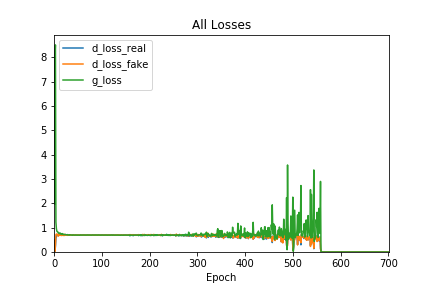

# Findings {#findings .unnumbered}

We divide our findings into two separate sections: GAN Training and Assessment of Model Output. 

## GAN Training {#findings-gan_training .unnumbered}
 
GAN models are notoriously hard to train properly. During training of our model, we encountered numerous issues which we have had varying degrees of success in addressing. The main issues are:

1. Error balancing. In many cases, the errors from the discriminator and generator often collapse to 0 or become extremely large.
2. Mode collapse. Model learns to generate one kind of output that is able to fool the discriminator despite random input.

We will be referring to discriminator and generator losses in the following section. To clarify, discriminator loss is loss from training the discriminator specifically and generator loss is the loss from training the adversarial model.

### Error Balancing {.unnumbered}

Using the data we collected from the training process, we find that the GAN training can be summarized into three distinctive stages:

1. The initial chaos. The generator and discriminator are trying to balance each other out and the error can vary drastically from epoch to epoch and either the discriminator or generator loss can be much larger than the other. It often settles into a more balanced stage, but this is not a given as we observe some models being unable to get past this initial stage.
2. The stable equilibrium. The model enters into a stable stage characterized by similar magnitude of losses between discriminator and generator and across different epochs. Judging from the quality of the output, it is during this period when the model learned the most from training data and generated the most musical samples.
3. The final collapse. This stage is characterized by a steady increase in loss magnitude in one of or both the generator and the discriminator, until the losses of either model collapsing to 0. There are even rare cases where both the discriminator and generator losses go down to 0. Learning stops and music generated gets worse and worse.

In the following plot of average epoch losses from one of the training sessions, we can observe these three distinctive stages:

```{r, out.width="0.3\\linewidth", include=TRUE, fig.align="center", fig.cap=c("Training Loss Graph"), echo=FALSE}

```

During the first 25 epochs or so we observe an initially high but declining losses for both the discriminator and the generator. Thereafter we enter the stable stage that lead to significant and high-quality learning where the loss stablized around 0.7 for both the discriminator and the generator. However, losses become unstable again starting around the 300 to 400 epoch mark and by the 500th epoch the generator loss has increased to around 2 while the discriminator loss is steadily declining. Finally, at around epoch 560, all losses go to zero and the model ceases to learn. 

It seems that the model showed the most promise during the stable equilibrium stage. While it is hard to show the quality of the generated samples in a mathematic way, we can clearly demonstrate this by hearing generated samples at different number of epochs. Here is the [link](https://github.com/terrywang15/museG_dev/tree/master/2020-01-31%2002-20) to our github page to access the generated samples at every 100 epochs during the training session above. At the first epoch, the output from the generator has no sense of rhythm or melody and its output is simply random notes. After 100 epochs, it is clear that there are improvements in rhythm, but the melody is still lacking. At epoch 200 the notes sound much more pleasant as they generally come from the same key. We see more improvement at epoch 300 and 400, which we believe is the best sample generated. However, the improvement trends are reversed starting at epoch 500, and the samples generated become increasingly nonsensical.

This observation shows that the conventional GAN model training procedures that try to balance discriminator and generator learning have much to improve upon, as it fails to prevent the generator to learn how to generate samples that is able to produce zero loss both for the discriminator and at the adversarial stage. One explanation is that the the fake input to the discriminator when training the discriminator is different from when training the adversarial model: the input to train the discriminator has a preprocess step to take argmax of the softmax vector and make a one-hot vector on the argmax index, meaning that it has the same format as the real samples, but during the adversarial stage this is not the case as the discriminator is fed output from the generator directly without preprocessing. This will be addressed with an update to the model.

However, this loss collapse happened after the losses become wildly unstable. So even if we were to correct the loss collapse issue, we still need to address the loss oscillation problem. Since the evidence seems to show that losses stability and generated sample quality are positively correlated, ideally we would want this stage of stable equilibrium to last as long as possible. To achieve that, we can either improve on the model structure, or revise the training procedures. We will discuss some of our ideas for improvement in a later section.

### Mode Collapse {.unnumbered}

Mode collapse is a common problem for GAN models[^1] **maybe figure out correct format for citations**. It happens when the generator finds one single pattern that is able to fool the discriminator and then mapping the random noise input to that pattern, so that all outputs from the generator are very similar.

[^1: See p113, Generative Deep Learning]

```{r summary}
kable(summary(ToothGrowth), align = "r", caption = "Summary of ToothGrowth data",
      format = "latex", longtable = TRUE)
```

Table \@ref(tab:summary) above contains summary statistics of the _Tooth Growth_ data.

While the code is not displayed to create the graph below (`echo=FALSE`), it is displayed in the Appendix by referencing the `boxplot` chunk name..

```{r boxplot, echo=FALSE, warning=FALSE,  message=FALSE, fig.cap="Avg. length by  supplement and dose", fig.width=6}
data(ToothGrowth)
colnames(ToothGrowth) <- c("length", "supplement", "dose")
ToothGrowth$dose <- as.factor(ToothGrowth$dose)

groupedTooth <- aggregate(ToothGrowth, by=ToothGrowth[,2:3], FUN=mean)[,1:3]

library(ggplot2)
 ggplot(ToothGrowth, aes(x = supplement, y = length)) + 
                     geom_boxplot(aes(fill=supplement)) + 
                     facet_wrap(~dose) + 
                     guides(colour = guide_legend("Color = Supplement")) + 
                     labs(x="Orange Juice or Vitamin C, grouped by dose", 
                          y="Odontoblast Growth (microns)")  +
                     theme_bw()
```

Figure \@ref(fig:boxplot) was created with the `ggplot2` package. We can visually compare the average tooth growth by `supplement` and `dose`.

## Modeling results  {.unnumbered}

First, use a `t.test()` to test _if_ dosage leads to growth of incisor length. From the results below, it appears every test rejects the null hypothesis.

```{r t-test}
test1 <- t.test(length ~ dose, ToothGrowth, dose %in% c(0.5,1)) 
test2 <- t.test(length ~ dose, ToothGrowth, dose %in% c(0.5,2))
test3 <- t.test(length ~ dose, ToothGrowth, dose %in% c(1,2)) 

testAgg <- data.frame(Name = c("Test 0.5-1", "Test 0.5-2", "Test 1-2"),
                  Method = c(test1$method, test2$method, test3$method), 
               Pvalue = c(test1$p.value, test2$p.value, test3$p.value), 
          Tstat = c(test1$statistic, test2$statistic, test3$statistic))

kable(testAgg, digit = 7, align = "r", caption = "t-test results", 
      format = "latex", longtable = TRUE)
```

Table \@ref(tab:t-test)

## Results of model performance and validation  {.unnumbered}

Next, subset the `ToothGrowth` data into seperate data sets defined by supplement dose of 0.5, 1, and 2 mg. This allow us to controlling for dose increases of _economic_ significance.

Subset tooth data into a separate `data.frame` for each dosage level. Then Execute the `t.test()` function for the dosage of 0.5 mg and display the results. 

```{r}
dose05 <- ToothGrowth[ToothGrowth$dose == 0.5, ] 
 dose1 <- ToothGrowth[ToothGrowth$dose == 1, ]
 dose2 <- ToothGrowth[ToothGrowth$dose == 2, ]

 test4 <- t.test(length ~ supplement, data = dose05)
 test5 <- t.test(length ~ supplement, data = dose1)
 test6 <- t.test(length ~ supplement, data = dose2)
```

Place the results of the analysis directly into your content with ***inline code*** functions:

With a very low p-value of `r round(test4$p.value, 4)` and a corresponding t-statistic of `r round(test4$statistic, 4)`, it appears that at low doses, _Orange Juice_ is the preferable delivery mechanism to _Vitamin C_ for Ascorbic Acid delivery.

The p-value and t-statistic above have been directly extracted from the model object and printed inline. using the 'r foo' syntax with quotes(') replaced by back-ticks (`).


