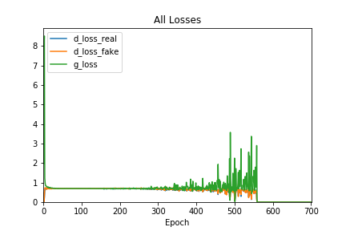
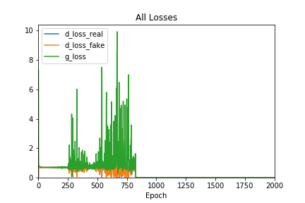

# Findings {#findings .unnumbered}

We divide our findings into two separate sections: GAN Training and Assessment of Model Output. 

## GAN Training {#findings-gan_training .unnumbered}
 
GAN models are notoriously hard to train properly. During the training of our model, we encountered numerous issues and had some success in addressing them. The main issues are:

1. Loss balancing. In many cases, the losses from the discriminator and generator often collapsed to zero or become extremely large. To clarify, discriminator loss is loss from training the discriminator specifically and generator loss is the loss from training the adversarial model.
2. Mode collapse. The model learned to generate one kind of output that was able to fool the discriminator regardless of input.

### Loss Balancing {.unnumbered}

Using the data we collected from the training process, we found that the GAN training can be summarized into three distinct stages:

1. The initial chaos. The generator and discriminator are trying to balance each other out and the error can vary drastically from epoch to epoch. The loss of either the discriminator or generator loss can be much larger than the other. It often settles into a more balanced stage, but this is not a given as we observe some models being unable to get past this initial stage.
2. The stable equilibrium. The model enters into a stable stage characterized by a similar magnitude of losses between discriminator and generator across different epochs. Judging from the quality of the output, it is during this period when the model learned the most from training data and generated the most musical samples.
3. The final collapse. This stage is characterized by a steady increase in loss magnitude in either the generator or the discriminator or both until the losses of either model collapsing to zero. There were even rare cases where the losses from both the discriminator and generator went down to zero. In that scenario, learning stops and mode collapse set in.

In the following plot of average epoch losses from one of the training sessions, we can observe these three distinctive stages:

```{r, out.width="0.8\\linewidth", include=TRUE, fig.align="center", fig.cap=c("Training Loss Graph"), echo=FALSE}

```

During the first 25 epochs or so, we observed initially high but declining losses for both the discriminator and the generator. Thereafter, we enter the stable stage that lead to significant and high-quality learning where the loss stablized around 0.7 for both the discriminator and the generator. However, losses became unstable again starting around the 300th to 400th epoch mark and by the 500th epoch the generator loss increased to around 2 while the discriminator loss steadily declined. Finally, at around epoch 560, all losses went to zero and the model ceased learning. 

It seems that the model showed the most promise during the stable equilibrium stage. While it is hard to show the quality of the generated samples in a mathematic way, we can clearly demonstrate this by hearing generated samples at different number of epochs. Here is the [link](https://github.com/terrywang15/museG_dev/tree/master/2020-01-31%2002-20) to our github page to access the generated samples at every 100 epochs during the training session above. At the first epoch, the output from the generator has no sense of rhythm or melody and its output is simply random notes. After 100 epochs, it is clear that there are improvements in rhythm, but the melody is still lacking. At epoch 200 the notes sound much more pleasant as they generally come from the same key. We see more improvement at epoch 300 and 400, which we believe is the best sample generated. However, the improvement trends are reversed starting at epoch 500, and the samples generated become increasingly nonsensical.

This observation shows that the conventional GAN model training procedures that try to balance discriminator and generator learning have much to improve upon, as it fails to prevent the generator to learn how to generate samples that is able to produce zero loss both for the discriminator and at the adversarial stage[^1].

[^1]: One explanation is that the the fake input to the discriminator when training the discriminator is different from when training the adversarial model: the input to train the discriminator has a preprocess step to take argmax of the softmax vector and make a one-hot vector on the argmax index, meaning that it has the same format as the real samples, but during the adversarial stage this is not the case as the discriminator is fed output from the generator directly without preprocessing. This will be addressed with an update to the model. However, there is also a good chance that there are other reasons for the collapse in losses, as this phenomenon is observed in many other GAN models.

It also seems that the loss collapse follows right after the wild oscillations in losses. Since the evidence seems to show that losses stability and generated sample quality are positively correlated, ideally we would want this stage of stable equilibrium to last as long as possible. To achieve that, we can either improve on the model structure, or revise the training procedures. We will discuss some of our ideas for improvement in a later section.

### Mode Collapse {.unnumbered}

Mode collapse is a common problem for GAN models[^2]. It happens when the generator finds one single pattern that is able to fool the discriminator and then mapping the random noise input to that pattern, so that all outputs from the generator are very similar.

[^2]: p.113, [@foster2019]

An example of mode collapse is found in one of our training sessions. Judging from the samples, the model seems to learn relatively well during the first few hundred epochs, but starting from epoch 900, the generator will only generate the same sample over and over again. Use this [link] (https://github.com/terrywang15/museG_dev/tree/master/2020-02-11%2022-13) to download and listen to all the samples.

After some investigations, it seems that mode collapse is related to the loss issue described above: mode collapse only happened after all losses collapsed to near zero. Notice in the below graph recording the average epoch losses from the training session that generated the samples mentioned above, the generator started to generate the exact same samples around epoch 900, shortly after the collapse of losses:

```{r, out.width="0.8\\linewidth", include=TRUE, fig.align="center", fig.cap=c("Mode Collapse Loss Graph"), echo=FALSE}

```

It is unknown at this point whether the collapse in losses and mode collapse are related or if we encountered a special case. However, it is clear that we will need to have a mechanism to monitor losses which will indicate to us whether the model is learning effectively.

### Ideas for Improvements on Model Structure and Training {.unnumbered}

#### 1. Model Structure Changes to Separate Pitch Loss and Duration Loss {.unnumbered}

One hypothesis that we pursued is that having one dedicated generator for pitch and duration would work better than our baseline model. The idea behind this is that, since pitch and duration are very different data types that differ in magnitude when comparing typical losses generated, it would make more sense to separate them so that loss is distributed proportional to how the model performs in terms of pitch and duration.  This way, if a model does well in pitch and not duration, for example, the model would devote more losses to duration and less to pitch.

We proceeded to try this idea out, and had one generator each for pitch and duration. However, preliminary results are not very encouraging as the model has so far failed to generate any musical sounding samples.

#### 2. Change to a Different Loss Metric {.unnumbered}

One idea that has worked well in music generation is the Wasserstein loss, which according to its authors is a more meaningful loss metric that correlates better with output quality as well as stablizes the GAN training process[^3]. We have yet found time to implement this in our model, so we will leave it as a potential next step.

[^3]: For details see p115, Generative Deep Learning

#### 3. Automated Monitoring of Losses During Training {.unnumbered}

As we have observed, preserving and prolonging the long-term loss stability stage during training should be the goal. We propose to have the following system set up in the training script:

1. Record losses during every batch
2. At the end of each epoch, calculate average losses (for generator and discriminator) for that epoch, and record it
3. Wait until model "warms up" or enters the stable learning stage. We can manually define how this look like or use a metric (such as stationarity)
4. Establish a metric for trend stability. This can be the standard deviation of the new epoch's losses compared to the distribution of losses from the stable process
5. Stop training when losses shoot up for x number of epochs. We have observed that once the training enters the final collapsing stage it rarely finds its way back, so its better to terminate training rather than keep going in the hopes of finding the stable stage again

#### 4. Automated Model Structure Changes During Training {.unnumbered}

A more advanced idea that we have been considering is to combine automated loss monitoring with flexible model structures. The idea would go as follows:

1. Make a basic generator/discriminator model with as few layers as possible
2. Train model until it enters stable stage
3. Monitor losses, stop training when losses start to increase
4. Freeze current model weights
5. Add new layer to generator and/or discriminator (can have some conditions to trigger this for generator or discriminator)
6. Train this new model until loss start to increase. Repeat the process as needed or use a stopping criterion

This way, we hope to maximize learning during the stable stage for each layer while avoiding many of the problems that we have encountered during our training. We believe this is a modeling technique that we should attempt in our next steps.

\newpage

## Musical Assessment of Model Output {#findings-assess_model .unnumbered}

One of the most significant achievements of our generator is that it successfully learned many musical structures despite being fed random snippets of data, demonstrating that GAN model structure is quite flexible in dealing with different forms of data and formats. To illustrate the musicality of generated outputs, we will focus on one generated sample that showed the success of our generator.

The particular sample can be found via this [link](https://github.com/terrywang15/museG_dev/blob/master/2020-01-31%2002-20/ep_400.mid). The notes of the sample is shown in the following table:

| Pitch | Start Time | End Time |
|-------|------------|----------|
| C5    | 0.000000   | 0.020455 |
| A3    | 0.000000   | 1.888636 |
| G4    | 0.000000   | 2.688636 |
| F#3   | 0.500000   | 4.229545 |
| D5    | 2.313636   | 3.797727 |
| F#4   | 2.884091   | 2.979545 |
| G3    | 3.020455   | 6.768182 |
| E3    | 3.181818   | 3.677273 |
| D4    | 3.827273   | 4.877273 |
| D5    | 3.981818   | 4.375000 |
| E5    | 4.145455   | 4.156818 |
| C4    | 4.747727   | 5.856818 |
| E4    | 5.190909   | 6.336364 |
| A3    | 5.904545   | 6.263636 |
| C5    | 5.938636   | 7.293182 |
| E3    | 6.606818   | 7.634091 |
| B3    | 8.020455   | 8.075000 |
| D4    | 8.511364   | 8.545455 |
Table: Generated Midi Sample

When listening to this sample, one can't help but notice how "musical" it sounds. This is because it has a structure that adheres to classical western music theory, as well as pattern repetition, things that are essential to human enjoyment of music [@levitin2006].

The sample begins with an ambiguous chord (A3, G4, C5) which is a transposed version of an A minor 7 chord with the fifth missing[^4], but this chord is abruptly transitioned to the (F#3, A3, G4) chord, a very dissonant chord that, although jarring, start to pull the song in the direction of the E minor key because of the introduction of the F# note that is characteristic of the G major/E minor, so overall the beginning sequence establishes the key structure of this sample. The F#3 note also has a strong tendency to go up a half-step and resolve to G3, which we will learn that it does right after.

The next sequence of notes are very interesting. It starts with the melody line of D5, F#4, G3, and E3, a remarkably smooth transition that implies D major with the major third as the root (F#), which transitions to E minor (G3, E3)[^5]. There are several remarkable things happening here: first, the generator chooses a melody line that spans a wide range of octaves, giving it a sound that is very characteristic of piano music; second, the melody smartly includes the note G3, which serves the dual purpose of resolving the jarring F#3 note from the beginning sequence and anticipating the next chord (E minor). 

After this sequence, the sample has firmly established an E minor feel. Next, it features an additional transition to C major then A minor through a very interesting setup (D4, D5, E5, C4, E4, A3). The octave-skipping D notes at the beginning is again found in many piano music and serves to reinforce the the D note, a note that clashes somewhat with the E minor chord the sample is in at that point and has a tendency to resolve to E or go down to C. After introducing this tension, the sample deftly does both of these things: the leading D5 goes up to E5 as a glide, the D4 goes down to C4, exactly what we would expect. But notice how the two resolutions went in different directions: D4 went down a step, while D5 went up a step. This kind of arrangement is very common in Baroque era music, which generally shuns multiple voices moving in parallel[^6]. Finally, an E4 is played after C4 to anchor the chord with a major third and removing ambiguities to what the implied chord is. This is followed by an A3 note which is again a smooth transition because it transitions to a new chord (A minor) by only adding one note (A3) while keeping the other notes (C4, E4) the same.

[^4]: There are other interpretations for this chord of course, and this is by no means a professional assessment strictly based on music theory.
[^5]: See [@wiki_circle_of_fifths]. The D major chord should transition to G major but can also transition to E minor.
[^6]: See [@wiki_counterpoint]

The ending sequence also features an interesting movement that could be interpreted as an attempt to make a key change in the context. The note sequence (C5, E3, B3, D4) can be understood as an attempt to move from the A minor or C major to a B major. Either way, it would entail a parallel shift of voices up or down a whole step, something that Baroque does not like. The generator's solution to this problem is to spread out the the two voices by almost 2 octaves (C5, E3) then bringing them together closer, with the C5 moving down to D4 and E3 moving up to B3. Also, the kind of resolving chords to something a half step lower (C chord to B chord) is commonly heard in Jazz and certainly makes sense in music theory. The reason that this sounds like a transition to a different key is because B is never heard throughout the sample up to that point, in addition to the sudden break in rhythmic pattern.

Speaking of rhythms, this generated sample also seems to have learned to produce coherent rhythmic structure. For example, in this sample melody line (D5, F#4, G3, E3) has a rhythmic pattern consisting of a long note followed by several short notes. The next melody line (D4, D5, E5, C4) references the structure of the preceding notes by reversing it: it now has several short notes followed by a long note. This kind of rhythmic construction is what gives a melody line a "human" feel, because it creates a pattern that repeats itself and at the same time is different in each repetition. Moreover, the rhythm and melody seem to work extremely well together, showing the success of our model structure which generates pitches and duration from the same latent space.

We now can see how the generator under the GAN structure achieved outputs of the following:

1. It learned basic music theory such as keys and chords;
2. It learned what rhythm sounds natural
3. It learned to consider past and future notes as a whole and try to create repeated patterns;
4. It learned highly abstract ideas such as chord progression and avoidance of clashing voices.

Even more remarkable is how this is achieved without relying on explicitly encoding any artificial structures, such as LSTM or the Attention mechanism, in the generator in order to "force" the model to learn self-referencing behavior and pattern recognition. It shows the remarkable flexibility of the deep neural network architecture. At the same time, more attention must be paid on the training steps in order for this model to learn as much useful information as possible.
