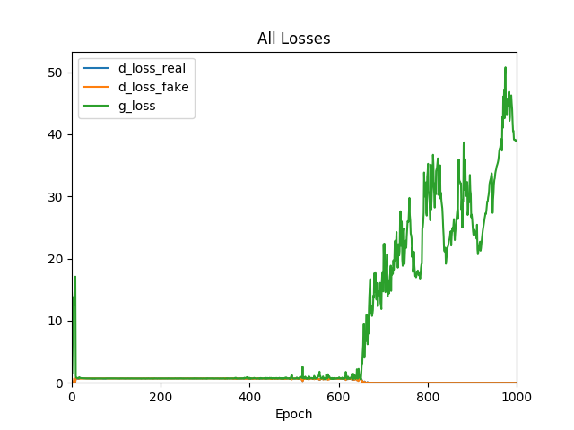
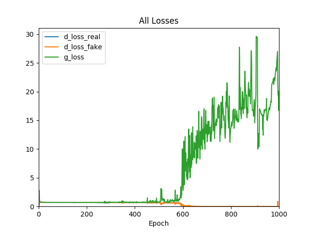
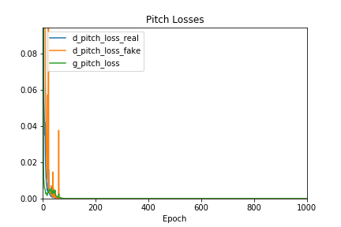
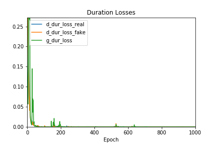
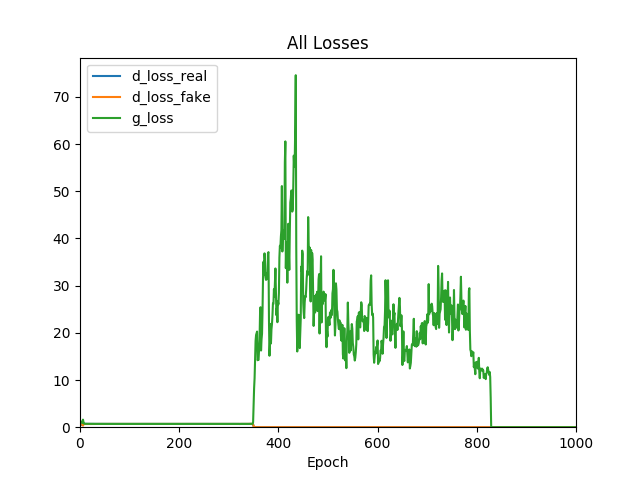

`r if(knitr:::is_latex_output()) '\\appendix'`

`r if(!knitr:::is_latex_output()) '# (APPENDIX) Appendix {-}'` 

<!--
If you feel it necessary to include an appendix, it goes here.
-->


# Additional Experimentations in Model Structure

We have performed additional experiments on our baseline model, which is shown in the Methodolody section. All changes in model structure are relative to the baseline model.

**Increase Nodes per Layer in Generator from 256 to 512**

For this run, we kept the basic model structure in place, with the only change being increasing the number of nodes in each layer in the generator to 512, from 256. Additional nodes should help the model break down the problem deeper and gain extra levels of abstraction of the music generation process.

```{r, out.width="0.8\\linewidth", include=TRUE, fig.align="center", fig.cap=c("Loss Graph, 512 Nodes"), echo=FALSE}

```

We see that during this run the stable learning stage ended just around 650 epochs, an improvement on the baseline run whose stable stage lasted until around 500 epochs. This could be a promising direction to improve the model, but addtional experimentation is needed to confirm this.

**Adding a Dense Layer to Generator**

For this run, we kept the basic model structure in place, with the only change being adding an additional Dense layer (along with its corresponding dropoff and batch normalization layers) to the generator. Additional layers should work similarly to adding nodes to existing dense layers and help model to learn higher levels of abstractions.

```{r, out.width="0.8\\linewidth", include=TRUE, fig.align="center", fig.cap=c("Loss Graph, Extra Dense Layer"), echo=FALSE}

```

For this particular run, we see the stable stage ended just before 600 epochs, indicating that this could be a promising way to improve the model. 

**New Model Structure with Separate Generators for Pitch and Duration**

For this run, we made a separate generator each for pitch and duration (with their corresponding discriminators). The model structure remain unchanged from the baseline model. This means that, instead of the generator outputting the entire 20-note sample, two separate generator will output one 20-note pitch sample and one 20-note duration sample. The reason for this experimentation was the hypothesis that pitch and duration are different datatypes with different magnitudes for error, therefore separating the amount of error fed into them is a better choice.

```{r, out.width="0.8\\linewidth", include=TRUE, fig.align="center", fig.cap=c("Loss Graph, Pitch Generator"), echo=FALSE}

```

```{r, out.width="0.8\\linewidth", include=TRUE, fig.align="center", fig.cap=c("Loss Graph, Duration Generator"), echo=FALSE}

```

However, under this setup the model completely failed to learn, as indicated by the loss graphs. This indicates that pitch and duration have intrinsic connections within themselves and cannot be generated as separate processes.

**Training Using 30-note Samples**

For this run, we tried to use 30-note samples as training data. Subsequently, we changed the generator output from 20-note samples to 30-note samples to match the training data.

```{r, out.width="0.8\\linewidth", include=TRUE, fig.align="center", fig.cap=c("Loss Graph, 30 Note Training Samples"), echo=FALSE}

```

Despite achieving around 350 epochs of stable learning, the model failed to learn properly from the data and the output does not show musicality.
